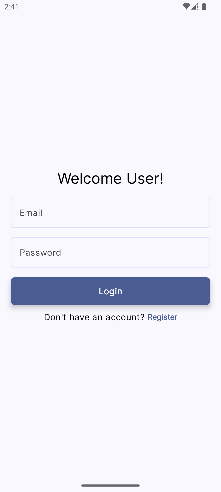
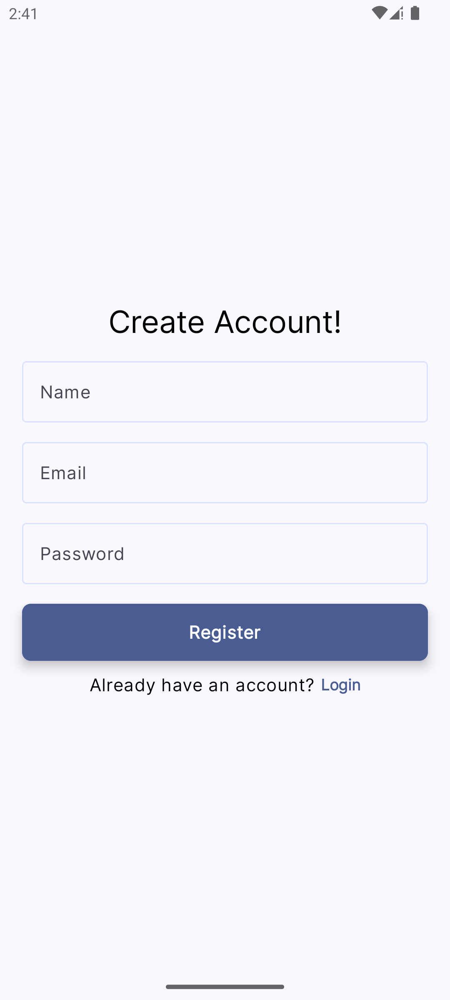
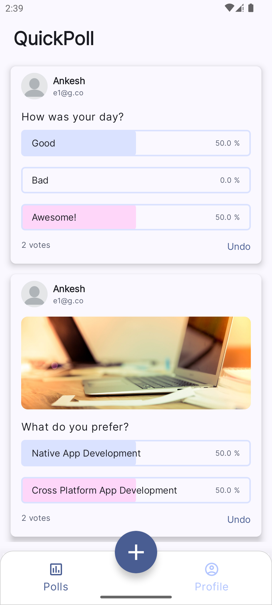
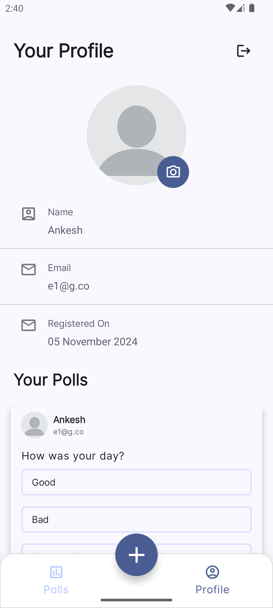
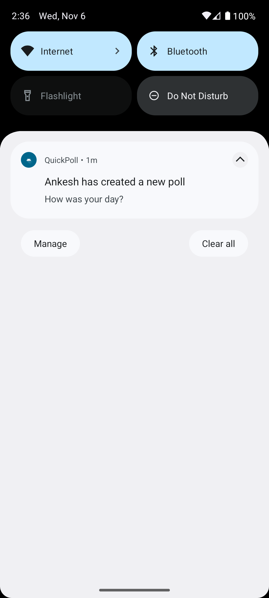
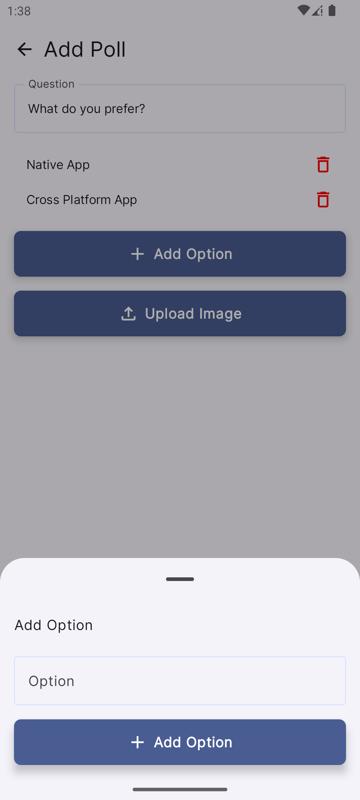

# Description

App name - **QuickPoll**

QuickPoll is an android app which lets you create and interact with polls.

## Features

- Create and vote on polls.
- Supports Image attachment with polls.
- Secured user authentication.
- Notifications for new polls.

## Screenshots

| LOGIN                 | REGISTER                 | POLLS_TAB              |
 -----------------------|--------------------------|------------------------|
|  |  |  

| PROFILE_TAB            | NOTIFICATION                 | ADD_POLL
 ------------------------|------------------------------|-------------|
|  |  | 

## Tech Stack

- Jetpack Compose for UI
- Androidx-navigation (navigation-compose and hilt-navigation-compose) library for type-safe navigation
- MVVM (Model-View-ViewModel) architecture pattern
- Dagger-hilt for dependency injection
- Retrofit and okhttp interceptors for network operations and communicating with backend
- Preferences DataStore for local data storage
- Firebase Messaging Service (Firebase Cloud Messaging) for push notifications
- Kotlin coroutines and flows for asynchronous operations and data handling
